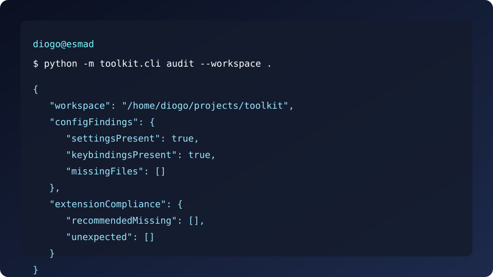

<!--
MIT License
Copyright (c) 2025 Diogo Ribeiro

Permission is hereby granted, free of charge, to any person obtaining a copy
of this software and associated documentation files (the "Software"), to deal
in the Software without restriction, including without limitation the rights
to use, copy, modify, merge, publish, distribute, sublicense, and/or sell
copies of the Software, and to permit persons to whom the Software is
furnished to do so, subject to the following conditions:

The above copyright notice and this permission notice shall be included in all
copies or substantial portions of the Software.

THE SOFTWARE IS PROVIDED "AS IS", WITHOUT WARRANTY OF ANY KIND, EXPRESS OR
IMPLIED, INCLUDING BUT NOT LIMITED TO THE WARRANTIES OF MERCHANTABILITY,
FITNESS FOR A PARTICULAR PURPOSE AND NONINFRINGEMENT. IN NO EVENT SHALL THE
AUTHORS OR COPYRIGHT HOLDERS BE LIABLE FOR ANY CLAIM, DAMAGES OR OTHER
LIABILITY, WHETHER IN AN ACTION OF CONTRACT, TORT OR OTHERWISE, ARISING FROM,
OUT OF OR IN CONNECTION WITH THE SOFTWARE OR THE USE OR OTHER DEALINGS IN THE
SOFTWARE.
-->

# vscode-productivity-toolkit

[](LICENSE)
[](https://github.com/DiogoRibeiro7/vscode-productivity-toolkit/stargazers)
[](https://github.com/DiogoRibeiro7/vscode-productivity-toolkit/network/members)
[](https://github.com/DiogoRibeiro7/vscode-productivity-toolkit/actions)

The **vscode-productivity-toolkit** is a production-ready collection of Visual Studio Code automations that help teams standardise their workspaces, accelerate onboarding, and keep developer environments secure. It combines curated settings, reusable tasks, and CLI tooling so you can bootstrap a consistent developer experience on Windows, macOS, and Linux in minutes.

## Table of Contents

- [Key Benefits](#key-benefits)
- [Repository Structure](#repository-structure)
- [Getting Started](#getting-started)
  - [Linux](#linux)
  - [macos](#macos)
  - [windows](#windows)
- [Usage Examples](#usage-examples)
- [Smart Task Detector Extension](#smart-task-detector-extension)
- [Quality Assurance](#quality-assurance)
- [Contributing](#contributing)
- [Support](#support)
- [License](#license)

## Key Benefits

- **Enterprise guardrails** – Opinionated defaults that align to secure and accessible coding practices for teams of any size.
- **Cross-platform automation** – Shell, PowerShell, and Python utilities engineered for Windows 10+, macOS 11+, and Ubuntu 20.04+.
- **Workspace observability** – Built-in auditing surfaces misconfigurations, extension drift, and opportunities for performance improvements.
- **Modular task ecosystem** – Extend the toolkit with Python, JavaScript, Docker, Git, or general-purpose tasks without disrupting existing workflows.
- **Adaptive automation** – The Smart Task Detector extension recommends and installs the right task suites based on your repository layout.

## Repository Structure

| Path | Description |
| --- | --- |
| `tasks/` | Task definitions and blueprints grouped by technology (Python, JavaScript, Docker, Git, and general automation). |
| `toolkit/` | Python package powering the CLI, logging, and task orchestration. |
| `settings/` | Battle-tested VS Code settings, keybindings, and extension recommendations. |
| `snippets/` | Language-specific code snippets for rapid prototyping and knowledge sharing. |
| `scripts/` | Installation and setup scripts for PowerShell, Bash, and Python automation. |
| `examples/` | End-to-end workflows demonstrating how to compose toolkit features. |
| `docs/` | Architecture notes, contribution guidelines, FAQs, and troubleshooting playbooks. |
| `.github/` | Repository automation including CI workflows, issue templates, and dependency management. |

Each directory contains contextual documentation to guide contributors and adopters.

## Getting Started

### Linux

```bash
# Clone the repository
 git clone https://github.com/DiogoRibeiro7/vscode-productivity-toolkit.git
 cd vscode-productivity-toolkit

# Optionally create an isolated environment
 python3 -m venv .venv
 source .venv/bin/activate
 pip install -r requirements.txt

# Apply recommended settings and extensions
 ./scripts/install.sh
```

### macOS

```bash
# Clone the repository
 git clone https://github.com/DiogoRibeiro7/vscode-productivity-toolkit.git
 cd vscode-productivity-toolkit

# Create a virtual environment (optional)
 python3 -m venv .venv
 source .venv/bin/activate
 pip install -r requirements.txt

# Install jq via Homebrew if required
 brew install jq

# Run the cross-platform installer
 ./scripts/install.sh
```

### Windows

```powershell
# Clone the repository
 git clone https://github.com/DiogoRibeiro7/vscode-productivity-toolkit.git
 Set-Location vscode-productivity-toolkit

# Create an isolated environment (optional)
 py -3 -m venv .venv
 .\.venv\Scripts\Activate.ps1
 pip install -r requirements.txt

# Execute the PowerShell installer
 ./scripts/install.ps1
```

For automated onboarding pipelines, the [`scripts/setup.py`](scripts/setup.py) helper orchestrates dependency installation and workspace configuration in one step.

## Usage Examples



```bash
# Generate an audit report for the current workspace
python -m toolkit.cli \
  --log-level INFO \
  audit \
  --workspace "." \
  --extensions "settings/extensions.json"
```

```bash
# Export recommended settings and keybindings into a project directory
python -m toolkit.cli configure --output ./.vscode --force
```

```bash
# Install recommended extensions with verbose plain-text logging
python -m toolkit.cli --plain-logs extensions --keep-going
```

Additional end-to-end recipes are available in the [`examples/`](examples) directory.

## Smart Task Detector Extension

The [`extensions/smart-task-detector`](extensions/smart-task-detector) package auto-detects project characteristics and offers tailored task suites through the VS Code UI.

- **Command palette** – Use `Toolkit: Detect Project Tasks` to analyse the workspace and `Toolkit: Install Recommended Tasks` to merge configurations safely.
- **Status bar** – A new status item summarises recommended collections and opens a multi-select quick pick for installation.
- **Problem matchers** – The extension contributes `$toolkit-*` matchers for Black, isort, flake8, mypy, pytest, ESLint, Jest, and npm audit outputs.
- **Configuration** – Toggle automation behaviour with the `vscodeProductivityToolkit.autoInstall`, `statusBar`, and `enableLogging` settings.

Compiled JavaScript is tracked in `dist/extension.js` so the extension can be published directly from the repository without a build step.

## Quality Assurance

The toolkit is protected by a comprehensive testing and compliance program:

- **Automated tests** – `pytest` executes unit, integration, and performance benchmarks across Ubuntu, macOS, and Windows runners.
- **Installer validation** – Bash, PowerShell, and Python installers are exercised in dry-run mode to ensure safe rollbacks and cross-shell resilience.
- **Schema enforcement** – All task collections are validated against a JSON schema to guarantee compatibility with VS Code 1.70+.
- **Documentation guards** – Markdown scanners verify code block metadata and prevent broken relative links.
- **Security scanning** – `bandit`, `npm audit`, and `shellcheck` run in CI to catch vulnerable dependencies and unsafe patterns.

See the [Quality Assurance Playbook](docs/quality-assurance.md) for the full matrix, manual verification checklist, and security controls.

## Contributing

We welcome contributions from the community and the broader Visual Studio Code ecosystem. Please review the following resources before opening an issue or pull request:

- [`docs/contributing.md`](docs/contributing.md) – Coding standards, review expectations, and branching strategy.
- [`docs/development.md`](docs/development.md) – Local development workflows, testing commands, and troubleshooting tips.
- Issue templates located in [`.github/ISSUE_TEMPLATE/`](.github/ISSUE_TEMPLATE/) to ensure actionable reports.

Pull requests must include automated test results and update documentation when behaviour changes. Semantic commit messages (e.g., `feat(tasks): add docker linting task`) are mandatory.

## Support

- Maintainer: **Diogo Ribeiro** (DiogoRibeiro7)
- Affiliation: *ESMAD - Instituto Politécnico do Porto*
- Professional email: [dfr@esmad.ipp.pt](mailto:dfr@esmad.ipp.pt)
- ORCID: [0009-0001-2022-7072](https://orcid.org/0009-0001-2022-7072)

For security disclosures, please email the maintainer directly instead of opening a public issue.

## License

Distributed under the MIT License. See [`LICENSE`](LICENSE) for details.
