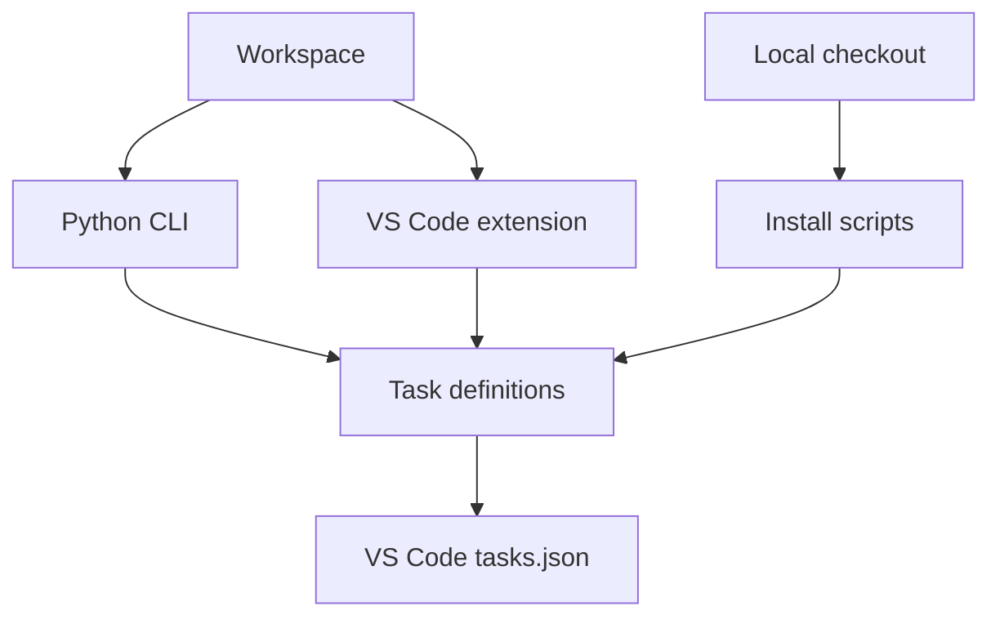

# Architecture

The repository has three ways to select task definitions. The Python CLI detects a workspace and downloads selected JSON files. Local installer scripts read the files in the checkout. The VS Code extension provides detection and a task manager inside the editor.

## Task definitions

The files under [`tasks/`](https://github.com/DiogoRibeiro7/vscode-productivity-toolkit/tree/main/tasks) contain VS Code tasks, inputs, and problem matchers. A task may invoke an external executable such as Python, npm, or Docker; the toolkit supplies task configuration, not those executables.

## Python CLI

`toolkit.detector.ProjectDetector` collects workspace evidence and suggests categories. `toolkit.installer.TaskInstaller` downloads selected definitions, merges task labels and inputs, backs up an existing `tasks.json`, and writes the workspace configuration.

## Extension and scripts

The [extension](https://github.com/DiogoRibeiro7/vscode-productivity-toolkit/tree/main/extensions/smart-task-detector) has its own project detector and task management service. The [install scripts](https://github.com/DiogoRibeiro7/vscode-productivity-toolkit/tree/main/scripts) provide local installation routes. Their configuration behavior is documented in [Getting started](getting-started.md).

The routes share task definitions but have separate implementations. Tests should cover interoperability when a workspace is modified by more than one route.
